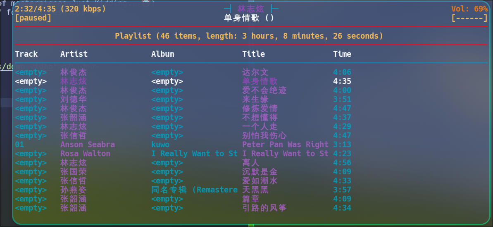
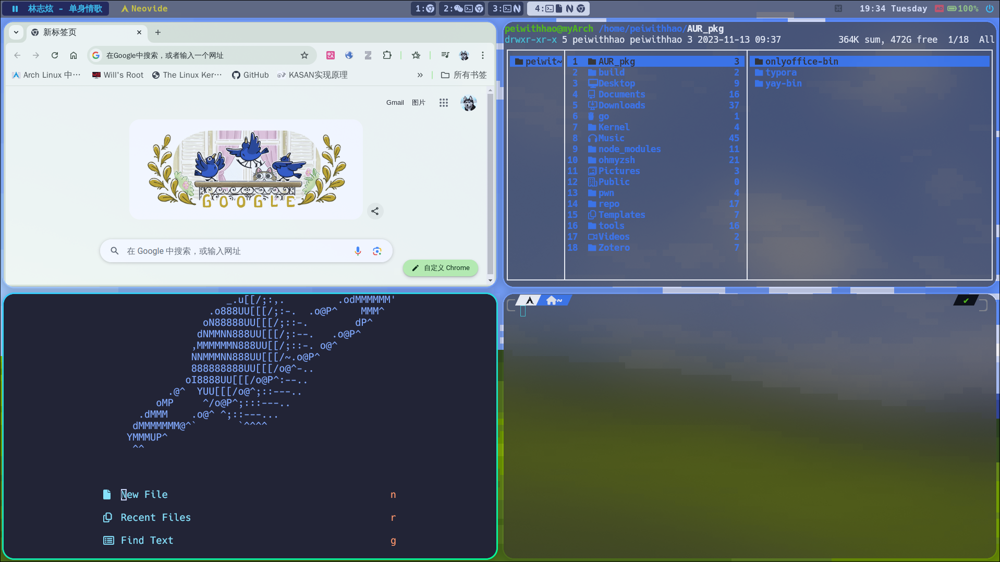

# How to Use it ?
Pass the Readme,JUST USE IT.

God Damn Jesus Christ

# Now We Have
+ hyprland(awasome!Although she have many question,sorrowful🙃)
+ ncmpcpp(is good with mpd 🎹)
+ nvim(a little complex, vim is more clean for me🍳)
+ waybar(A culmination of masterpieces,Just Kidding...🤡)
+ rofi(OK, a "must-have" for flat desktops 🍚)

# wallpaper

# Demo
<video src="./src/videos/demo_video"></video>

